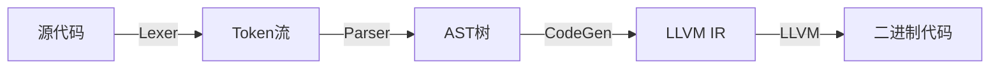

# Mask
<!-- 徽章 -->
[](https://github.com/zhanghaoxvan/mask)
[](https://github.com/zhanghaoxvan/mask/actions)
[](https://github.com/zhanghaoxvan/mask/releases)

## 语言切换 / Change Languages

| 简体中文 | English |
| :------: | :-----: |
| [查看中文](#chinese-content) | [View English](#english-content) |

---

### **<a id="chinese-content">简体中文</a>**  

### :rocket: 目标

1. 实现Mask语言的构建
2. 提供完善的包管理器

### :building_construction: 架构

Mask采用

目录树图览：
```
mask/
├── CMakeLists.txt
├── LICENSE
├── README.md
├── cmake/
│   └── message.cmake // CMake编译时显示信息
├── example/
│   └── main.ma // 语法示例
├── inc/
│   ├── ast.hpp // AST树
│   ├── codegen.hpp // LLVM IR生成（todo）
│   ├── inc.hpp // 必须库文件
│   ├── lexer.hpp // 词法分析器
│   ├── parser.hpp // 语法分析器
│   └── preprocessor.hpp // 预处理器，记录import
├── lib/
│   ├── compile.ps1
│   └── std
│       ├── compile.ps1
│       ├── fmt.ma
│       ├── libfmt.c
│       └── libfmt.so
└── src/
    ├── ast.cpp
    ├── codegen.cpp
    ├── lexer.cpp
    ├── main.cpp
    ├── parser.cpp
    └── preprocessor.cpp
```

---

### **<a id="english-content">English</a>**  

