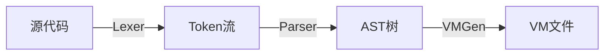

# Mask现状

[https://github.com/zhanghaoxvan/mask](Mask)现已迁移至[https://github.com/zhanghaoxvan/Gobol](Gobol).

## Warning Gobol的语法与Mask有差异

# Mask
<!-- 徽章 -->
[](https://github.com/zhanghaoxvan/mask)
[](https://github.com/zhanghaoxvan/mask/actions)
[](https://github.com/zhanghaoxvan/mask/releases)

## :rocket: 目标

1. 实现Mask语言的构建
2. 提供完善的包管理器

## :building_construction: 架构

Mask采用

目录树图览：
```
mask/
├── CMakeLists.txt
├── LICENSE
├── README.md
├── cmake/
│   └── message.cmake // CMake编译时显示信息
├── example/
│   └── main.ma // 语法示例
├── inc/
│   ├── ast.hpp // AST树
│   ├── vmgen.hpp // Mask VM生存 (todo)
│   ├── inc.hpp // 必须库文件
│   ├── lexer.hpp // 词法分析器
│   ├── parser.hpp // 语法分析器
│   └── mask-vm-parser.hpp // Mask VM解析器
├── lib/ // 库默认引用的库
└── src/
    ├── ast.cpp
    ├── codegen.cpp
    ├── lexer.cpp
    ├── main.cpp
    ├── parser.cpp
    └── mask-vm-parser.cpp
```
